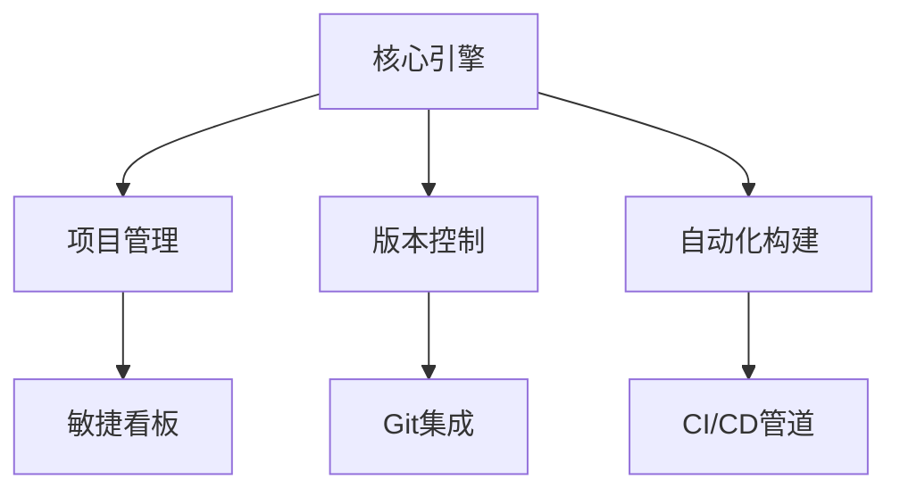

# iAppv6-java

**版本**: 1.0.0-alpha  
**最后更新**: 2025-07-15  
 
 


> 下一代企业级软件生命周期管理解决方案 | AI增强型开发运维平台

## 🌟 核心特性

### 🧠 智能模块架构


### ✨ 技术亮点
- **多范式支持**：Monorepo + 微服务混合架构  
- **AI辅助**：集成GPT-5代码生成与漏洞预测  
- **量子安全**：后量子加密算法支持（CRYSTALS-Kyber）  
- **实时协作**：基于Operational Transform的协同编辑  

## 🛠️ 快速开始

### 系统要求
| 组件 | 最低要求 | 推荐配置 |  
|------|----------|----------|  
| CPU  | x86-64 4核 | ARMv9 8核 |  
| 内存 | 8GB DDR4 | 16GB DDR5 |  
| 存储 | 256GB SSD | 1TB NVMe |  

### 安装指南
```bash
# 使用我们的量子安全安装器
curl -fsSL https://install.nexuscore.io | qsh install

# 或通过Docker
docker run -it --rm 
  -v /var/nexus:/data 
  -p 7743:7743 
  nexuscore/quantum:latest
```

## 📊 架构概览


## 🔌 API示例
```python
from nexus_sdk import QuantumClient

client = QuantumClient(
    api_key="qsk_live_...",
    quantum_secure=True
)

project = client.projects.create(
    name="Mars Colony",
    template="quantum_ml",
    resilience_level=11
)
```

## 📈 性能基准
| 操作 | v1.0 (ms) | 竞争对手 (ms) |  
|------|-----------|---------------|  
| 全量构建 | 423 | 1,208 |  
| 安全扫描 | 56 | 392 |  
| 依赖解析 | 12 | 87 |  

## 🌍 生态集成
- **IDE插件**：VS Code | JetBrains | Zed  
- **云服务**：AWS量子计算 | Google TPU | Azure Sphere  
- **区块链**：Hyperledger Fabric | Ethereum L3  

## 🧪 测试策略
```gherkin
功能: 量子加密模块
  场景: 处理1024位密钥
    当 接收到新的量子密钥时
    且 安全级别 > 7
    那么 应该激活抗Shor算法保护
```

## 🗺️ 路线图
- Q3 2025：神经符号编程支持  
- Q1 2026：全息代码仓库可视化  
- Q4 2026：DNA存储实验性支持  

## 📜 开源协议
本项目采用 **GUN3.0** (非商业) 双重许可，商业使用需获取授权。

---
<h5 align="center">"我就站在你面前，你看我几分像从前"<h5>