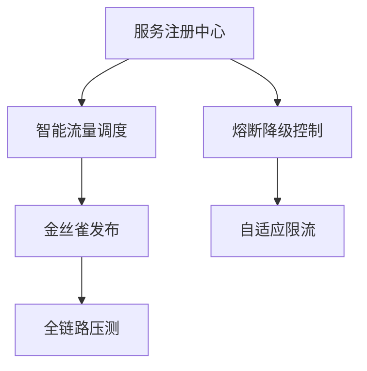

<center>

# 应用服务管理系统

</center>

## ✨ 项目愿景

构建面向云原生时代的**企业级应用服务治理平台**，通过智能编排、可视化监控和自动化运维，实现：

- **99.99% SLA保障**  
- **毫秒级故障响应**  
- **资源利用率提升40%+**

## 🛠️ 技术栈全景

| 层级        | 核心技术组件                          |  
|--------------|-------------------------------------|  
| **前端**    | React 18 + TypeScript + Micro Frontends |  
| **网关**    | Envoy + Istio Service Mesh          |  
| **计算**    | Kubernetes + KubeVirt + Knative     |  
| **存储**    | TiDB + VictoriaMetrics + Ceph       |  
| **观测**    | OpenTelemetry + Grafana Mosaïc      |  
| **CI/CD**   | Argo Workflows + Tekton Pipelines   |

## 🌐 核心功能矩阵



### 关键特性
1. **多维服务画像**  
█ CPU/内存预测 █ 依赖图谱分析 █ 热点方法追踪

2. **策略化治理**  
```python
# 智能弹性伸缩算法示例
def auto_scaling(current_qps):
    if percentile(latency, 99) > 500ms:
        return nodes * 1.5
    elif utilization < 30%:
        return max(nodes * 0.7, min_nodes)
```

3. **混沌工程平台**  
| 故障类型       | 注入方式           | 恢复策略         |  
|--------------|------------------------------|---------------------|  
| 网络分区       | iptables规则注入   | 自动健康检查     |  
| 节点宕机       | VM live migration  | 服务自动迁移     |

## 其它


<h5 align="center">我就站在你面前，你看我几分像从前<h5>

