# 应用服务管理系统

  
*现代微服务架构示意图*

## ✨ 项目愿景

构建面向云原生时代的**企业级应用服务治理平台**，通过智能编排、可视化监控和自动化运维，实现：

- **99.99% SLA保障**  
- **毫秒级故障响应**  
- **资源利用率提升40%+**

## 🛠️ 技术栈全景

| 层级        | 核心技术组件                          |  
|--------------|-------------------------------------|  
| **前端**    | React 18 + TypeScript + Micro Frontends |  
| **网关**    | Envoy + Istio Service Mesh          |  
| **计算**    | Kubernetes + KubeVirt + Knative     |  
| **存储**    | TiDB + VictoriaMetrics + Ceph       |  
| **观测**    | OpenTelemetry + Grafana Mosaïc      |  
| **CI/CD**   | Argo Workflows + Tekton Pipelines   |

## 🌐 核心功能矩阵

```mermaid
graph TD
    A[服务注册中心] --> B[智能流量调度]
    A --> C[熔断降级控制]
    B --> D[金丝雀发布]
    C --> E[自适应限流]
    D --> F[全链路压测]
```



### 关键特性
1. **多维服务画像**  
█ CPU/内存预测 █ 依赖图谱分析 █ 热点方法追踪

2. **策略化治理**  
```python
# 智能弹性伸缩算法示例
def auto_scaling(current_qps):
    if percentile(latency, 99) > 500ms:
        return nodes * 1.5
    elif utilization < 30%:
        return max(nodes * 0.7, min_nodes)
```

3. **混沌工程平台**  
| 故障类型       | 注入方式           | 恢复策略         |  
|--------------|------------------------------|---------------------|  
| 网络分区       | iptables规则注入   | 自动健康检查     |  
| 节点宕机       | VM live migration  | 服务自动迁移     |

## 🚀 部署拓扑

```bash
# 高可用部署方案（3AZ架构）
helm install sm-system ./charts 
  --set global.multiAZ.enabled=true 
  --set etcd.clusterSize=5 
  --set hpa.metrics=[cpu,memory,qps,latency]
```

## 📊 性能基准

  
*实测数据：单集群支撑20万QPS，P99延迟<2ms*

## 📜 开源协议

```legal
GNU GENERAL PUBLIC LICENSE Version 3
Copyright (C) 2025 应用服务管理系统项目组

This program comes with ABSOLUTELY NO WARRANTY;
This is free software, and you are welcome to redistribute it
under certain conditions; see LICENSE file for details.
```

## 🤝 贡献指南

1. 签署CLA协议  
2. 遵循GitFlow工作流  
3. 提交前运行：  
   ```bash
   make verify # 包含静态检查、单元测试、E2E验证
   ```

## 🌟 特别致谢

[](https://bestpractices.coreinfrastructure.org)

---

> "The art of simplicity is a puzzle of complexity." — Douglas Horton  
> 项目最新版本：v0.9.0-beta (2025-Q3)